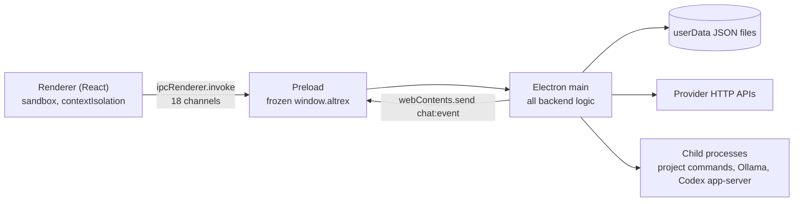

# ALTREX CODE — Current Architecture (as audited)

Status: Phase 0 audit, 2026-09-26. Describes what the code **did at the audit**, not what older docs intended.
Phase 1 has since fixed: startup Ollama blocking and orphaned process, missing checkpoints in Agent/Local/Codex modes, and disconnect cancelling unrelated requests. It also added `packages/core`, `packages/contracts` and `window.altrexCore`. See the [MIGRATION_PLAN.md phase log](MIGRATION_PLAN.md#phase-log).
Baseline commit: `55cf3ab` (the repository had no version control before the audit).

Validation run during the audit (Windows 11, Node 25.5, pnpm 11.9):

| Check | Result |
|---|---|
| `pnpm typecheck` (node + web tsconfigs, strict) | PASS |
| `pnpm test` (vitest) | PASS — 25 files, 101 tests, ~26 s |
| `pnpm build` (electron-vite) | PASS |
| Packaged / portable smoke (`release/*-startup-result.json`, prior run) | PASS — bridge connected |
| Live provider calls | NOT RUN (would spend quota; see "Live validation" below) |

## 1. Repository layout

```text
ALTREX CODE/
  package.json, pnpm-workspace.yaml   pnpm monorepo; workspace globs apps/*, services/*, packages/*
                                      (services/ and packages/ do not exist)
  apps/desktop/                       the only package: Electron 43 + React 19 + Vite 7 + Tailwind 4
    src/main/                         Electron main process — ALL backend logic lives here
      index.ts                        app lifecycle, windows, IPC handlers, diagnostics entry points
      provider-service.ts             credentials, catalog cache, health view, routing, mode dispatch (649 lines)
      providers/                      transport, request manager, OpenAI-compatible provider, adapters, model registry, context budget
      agent-runner.ts                 single-agent tool loop (Agent / Local modes)
      project-tool-broker.ts          file + command tools exposed to models
      project-command-runner.ts       child-process execution (allowlist, Windows quoting, tree kill)
      multi-ai/                       "Director" multi-worker orchestration (plan DAG, isolated copies, review, publish)
      codex-cli-agent.ts              drives the external OpenAI Codex App Server as an alternative agent engine
      repository-context.ts           keyword-scored repository excerpt builder
      attachment-service.ts           native file picker + attachment resolution
      local-ai-service.ts             Ollama runtime discovery / start / model pull
      task-budget.ts                  round/tool budgets and loop detection
    src/preload/index.ts              frozen contextBridge API (`window.altrex`)
    src/shared/                       types shared by main + renderer (IPC contract, provider registry, errors, router heuristics)
    src/renderer/                     React UI (owned by the frontend engineer going forward)
  docs/                               architecture/roadmap/security/UI docs (several describe unbuilt systems — see §12)
  release/                            built installers (git-ignored, 585 MB)
  .local-ai/                          bundled Ollama runtime + downloaded models (git-ignored, 9.2 GB)
```

~7,500 lines of TypeScript, dense style (many 150–300 character lines). No `services/`, no Python, no database.

## 2. Process model and trust boundary



What is solid here (preserve):

- `BrowserWindow` uses `sandbox: true`, `contextIsolation: true`, `nodeIntegration: false`; navigation and popups denied; permission requests denied ([index.ts:397](../apps/desktop/src/main/index.ts#L397)).
- Every IPC handler checks `isTrustedSender` (top frame, same webContents, `file:` or dev localhost origin).
- The preload exposes named methods only; no raw `ipcRenderer`.
- Projects must be opened through the native dialog (or be the remembered recent project) before chat requests may reference them (`trustedProjects`).

What is weak:

- **All heavy work runs on the Electron main thread**: synchronous SHA-256 snapshots of up to 30,000 files ([workspace.ts:16](../apps/desktop/src/main/multi-ai/workspace.ts#L16)), synchronous JSON rewrites of the model registry on every observation ([model-registry.ts:27](../apps/desktop/src/main/providers/model-registry.ts#L27)), `spawnSync where.exe` per command. Large repositories will freeze IPC and therefore the UI.
- Only `chat:start` has real payload validation; `provider:test`/`provider:connect` pass renderer objects straight to the service (partially validated later by `validateConnection`).

## 3. IPC contract (current)

Defined in [shared/desktop-api.ts](../apps/desktop/src/shared/desktop-api.ts). Request/response channels:

`dialog:open-project`, `project:recent`, `runtime:info`, `provider:status`, `provider:models`, `provider:refresh-models`, `provider:install-local-model`, `provider:diagnostics`, `attachment:pick`, `provider:test`, `provider:connect`, `provider:disconnect`, `provider:open-external`, `chat:start`, `chat:cancel`, `run:revise`, `run:list`.

One push channel, `chat:event`, carrying `ChatStreamEvent`:

```ts
type ChatStreamEvent = {
  requestId: string
  type: 'started' | 'delta' | 'activity' | 'files-changed' | 'command-result'
      | 'completed' | 'cancelled' | 'error' | 'run-state'
  run?: ProjectRun; delta?: string; message?: string; provider?: string; model?: string
  files?: string[]; command?: string; exitCode?: number | null; output?: string
}
```

Limitations: no sequence numbers, no replay, no task identity separate from the request, free-text `activity` strings carry routing/fallback/status information that the UI cannot interpret structurally, and `run-state` re-sends the entire `ProjectRun` object on every Director action.

## 4. Execution modes (four divergent paths)

`ProviderService.streamChat` ([provider-service.ts:492](../apps/desktop/src/main/provider-service.ts#L492)) dispatches on `request.mode` and `modelSelection`:

| Mode | Engine | Tools | Where edits land | "Verification" |
|---|---|---|---|---|
| ASK | `RoleRouter.stream` — streaming text | none | nowhere | n/a |
| AGENT + provider | `runCodingAgent` — non-streaming tool loop | list/read/write/edit/append/run_command | **directly in the user's project, no checkpoint** | regex on command text: an exit-0 command containing `test|build|lint|typecheck|check` sets `verificationPassed` ([agent-runner.ts:194](../apps/desktop/src/main/agent-runner.ts#L194)) |
| AGENT + CODEX | external Codex App Server over JSON-RPC stdio | Codex's own | **directly in the user's project**, auto-approved | whatever Codex reports |
| LOCAL | same as AGENT, provider filtered to Ollama; images pre-described by a local vision model | same as AGENT | directly in project | same regex |
| MULTI | `Director` — planned DAG, ≤3 parallel workers | workers: file tools only; Director runs checks | isolated copies → integration copy → journaled publication | discovered `typecheck/test/build` + LLM reviewer |

The MULTI path is by far the most engineered (isolation, scope ownership, conflict detection, publication journal with rollback). The AGENT path — the one most users hit — has the weakest safety and verification.

## 5. Provider subsystem

### 5.1 Supported providers

[shared/provider-registry.ts](../apps/desktop/src/shared/provider-registry.ts) defines 10 presets, **all using one OpenAI-compatible HTTP protocol**: `google` (Gemini via its OpenAI-compatibility endpoint), `cerebras`, `cloudflare`, `ollama`, `sambanova`, `groq`, `openrouter`, `nvidia` (hosted NIM), `openai`, `custom`.

There is no native Gemini adapter and no Ollama-native API usage (only `/v1`). The per-provider "adapters" ([provider-adapters.ts](../apps/desktop/src/main/providers/provider-adapters.ts)) only tweak headers and request bodies, including model-name hacks (`gpt-5`/`o*` → `max_completion_tokens`; `nemotron-3-ultra` → thinking parameters, [provider-adapters.ts:57](../apps/desktop/src/main/providers/provider-adapters.ts#L57)).

ngrok is not referenced anywhere. A tunnelled server can already be configured through `custom` (HTTPS required for non-localhost).

### 5.2 Request pipeline

```text
ProviderService ─► RoleRouter (model-registry.ts) ─► OpenAiCompatibleProvider ─► RequestManager.execute ─► nativeTransport (node:http/https)
```

[RequestManager.execute](../apps/desktop/src/main/providers/request-manager.ts#L110) is the strongest piece of provider code and should be preserved conceptually:

- Separate deadlines: connection (socket connect/TLS), first token, stream idle (reset on each chunk), overall ([request-policy.ts](../apps/desktop/src/shared/request-policy.ts)).
- Per-provider concurrency queue; circuit-like states HEALTHY/DEGRADED/RATE_LIMITED/QUOTA_EXHAUSTED/OFFLINE.
- 413 / context-limit: shrinks the context budget and output reservation, retries once with less optional context.
- 429: honours `Retry-After` (≤30 s) once, then gives up for fallback. Transient 5xx/timeout/network: one jittered retry by default (`maxAttempts: 2`).
- Never replays a stream after content was delivered.
- Redacts the API key from outgoing messages, incoming text, and error details.
- Native transport decodes gzip/br/deflate (a real NVIDIA bug fix).

Weaknesses:

- Circuit/health state is **in memory only** and resets on restart. Auth failures set `offlineUntil = MAX_SAFE_INTEGER` ([request-manager.ts:101](../apps/desktop/src/main/providers/request-manager.ts#L101)), so a bad key is shown as OFFLINE, not AUTH_ERROR.
- Two parallel error vocabularies: legacy `FailureKind` and `ProviderErrorCategory`, plus an unused third (`describeProviderFailure`).
- **Streaming supports text only.** Tool calls are only parsed from non-streaming responses, so Agent/Multi modes never stream and the "first-token" deadline is effectively a whole-response deadline.
- Default input budget is a fixed **6,000 estimated tokens** regardless of the model's real context window ([request-policy.ts:12](../apps/desktop/src/shared/request-policy.ts#L12)). This strongly limits agent quality on large-context models.
- Queue admission busy-polls every 50 ms.

### 5.3 Error normalization

[shared/provider-errors.ts](../apps/desktop/src/shared/provider-errors.ts) maps HTTP status + body text to 14 categories with a sizeable regex corpus (quota vs. rate limit, invalid key vs. forbidden, model missing, tools unsupported, context too large, token-limit extraction). This corpus is valuable and should be carried into V4 with tests.

### 5.4 Model registry and routing

- [ModelRegistry](../apps/desktop/src/main/providers/model-registry.ts) persists `models.json` keyed by `provider:baseUrl:model` with capabilities where `null` means *unknown* (good discipline), health, last error, and per-role accepted/failed history.
- Capabilities are learned from probes (tiny chat, stream, "call the echo tool") and from successful use.
- Model selection is split across **three** places: `selectCodingModelCandidates` (regex scoring of model *names* plus hard-coded model ID lists, [shared/model-router.ts](../apps/desktop/src/shared/model-router.ts)), `ProviderService.routedConnections` ([provider-service.ts:460](../apps/desktop/src/main/provider-service.ts#L460)), and `ModelRegistry.rank`/`RoleRouter`. A fourth fallback chain inside `runCodingAgent` is reachable only from tests.
- Hard-coded model IDs (`gemini-3.8-flash`, `qwen/qwen3-coder-480b-a35b-instruct`, `nvidia/nemotron-3-ultra-550b-a55b`, `minimaxai/minimax-m2.7`, …) are embedded as defaults and preferences. The previous live validation already found the default NVIDIA model returning HTTP 410.
- Discovered catalogs are cached for 10 minutes in `provider-models.json`, but only model IDs are kept — metadata that providers expose (context length, pricing, tool support) is discarded.

### 5.5 Credentials

- API keys are encrypted with Electron `safeStorage` (DPAPI on Windows; Linux `basic_text` refused) and stored base64 in `userData/credentials/provider.json` (active profile) and `provider.json.profiles` (all profiles), written atomically with mode 0600.
- Keys never go to renderer persistence; the renderer holds a key only in a transient form field and sends it once through IPC for test/connect.
- `getStatus()` decrypts every stored key on every status call just to show the last four characters ([provider-service.ts:244](../apps/desktop/src/main/provider-service.ts#L244)).
- Decrypted keys then travel inside `ProviderRuntimeConnection` objects through the router, agent loop and Director (in memory only; not persisted, not logged).

## 6. Agent loop (`runCodingAgent`)

A single system prompt, full user conversation, and repository excerpt, then repeated non-streaming completions with the six coding tools. Behaviours worth keeping:

- Nudges a model that answers in prose without using tools; asks for verification if files changed but nothing was run.
- `TaskBudget`: 12/22/32 rounds by task size, extension only on measurable progress, loop detection on identical call+outcome.
- If the provider fails after files changed, runs a project check and preserves verified work.

Problems: success is "the model stopped calling tools"; no plan, no acceptance criteria, no review, no structured evidence; `requestsWorkspaceAction` is an English-keyword regex ([agent-runner.ts:11](../apps/desktop/src/main/agent-runner.ts#L11)).

## 7. Multi-AI Director (`multi-ai/`)

The most complete orchestration in the repo ([director.ts](../apps/desktop/src/main/multi-ai/director.ts)):

1. Copies project source into `userData/multi-ai/<runId>/integration` (ignores deps/build/secrets; limits 200 MB / 30k files).
2. Director model returns a JSON spec + task DAG, validated (IDs, ownership scopes, acyclic, 1–24 tasks) in [contracts.ts](../apps/desktop/src/main/multi-ai/contracts.ts).
3. Up to 3 workers in parallel; overlapping ownership is serialized; each attempt gets its own copy; writes outside owned scope are rejected.
4. Workers cannot run commands; they can `request_dependency`, which makes the Director add/reuse a task.
5. Per task: discovered project checks + read-only LLM reviewer; merged into integration with base-hash conflict detection; up to 3 attempts.
6. Final checks + integrated review; up to 2 repair tasks.
7. Publication to the real project re-checks original hashes, writes byte backups and a journal, rolls back on failure ([workspace.ts:43](../apps/desktop/src/main/multi-ai/workspace.ts#L43)).
8. Live revisions from the user cancel and re-plan only affected tasks.

Persistence: `run.json`, `base.json`, `publication.json`, per-project `memory-<hash>.json`. Interrupted runs become `INTERRUPTED` on restart (no auto-resume).

This design is close to what V4 wants for parallel/tournament work and should become the isolation + integration layer of the V4 orchestrator rather than a separate mode.

## 8. Tools and command execution

[ProjectToolBroker](../apps/desktop/src/main/project-tool-broker.ts): `list_files` (one directory, 250 entries), `read_file` (300-line windows, 2 MB cap), `write_file`, `edit_file` (unique exact match), `append_file`, `run_command`. Guards: relative paths only, traversal and symlink rejection, Windows reserved names, protected paths (`.git`, `.env*`, `*secret*`, `*.pem`…), per-task limits (40 writes, 5 MB, 15 commands).

Missing: delete, move, recursive listing/glob, text search, diffs, git operations, long-running processes, streamed output, patch application, stale-write protection (no check that a file changed since the model read it).

[project-command-runner.ts](../apps/desktop/src/main/project-command-runner.ts): argv-only execution (`shell: false`), Windows `.cmd` shims via `cmd /d /s /c` with metacharacter rejection, secret-looking env vars stripped, output capped at 200k chars, whole-tree kill on timeout/cancel (`taskkill /T /F` or process-group SIGKILL). This is good, well-tested code.

Its policy is an **executable-name allowlist** ([project-command-runner.ts:12](../apps/desktop/src/main/project-command-runner.ts#L12)) that includes `node`, `npx`, `npm`, `python`, `git`, `make`, `cargo`, … In practice this is arbitrary code execution: the model can write a script and run it, `npx` any package, or run `git reset --hard` / `git push --force`. There is no approval step and no network control.

## 9. Codex engine

[codex-cli-agent.ts](../apps/desktop/src/main/codex-cli-agent.ts) locates a Codex binary, starts `codex app-server --stdio` with `sandbox_workspace_write.network_access=true`, and auto-accepts file-change, command and permission requests whose paths stay inside the project ([codex-cli-agent.ts:348](../apps/desktop/src/main/codex-cli-agent.ts#L348)). Changed files are detected afterwards by an mtime/size snapshot. It is a useful optional external engine but bypasses every ALTREX policy, checkpoint and verification mechanism.

## 10. Context and repository understanding

[repository-context.ts](../apps/desktop/src/main/repository-context.ts): directory tree (depth 4, 400 entries), keyword scoring over the first 200 source files, follows relative imports one hop from the top 4 matches, includes README/package manifests, 16k-character cap (6k–9k in Director calls).

[context-manager.ts](../apps/desktop/src/main/providers/context-manager.ts) budgets each request: keeps system instructions, earlier user requirements, the latest user turn, then newest complete assistant/tool groups; clips optional context. It locates the repository excerpt by splitting system text on the literal marker `Repository context:\n` ([context-manager.ts:21](../apps/desktop/src/main/providers/context-manager.ts#L21)) — fragile coupling between prompt wording and budgeting.

No index, no ripgrep, no symbols/AST, no reference graph, no test mapping, no git-history signals, no persistent working set.

## 11. State and persistence

| Data | Location | Format |
|---|---|---|
| Recent project | `userData/state/recent-project.json` | JSON |
| Provider credentials | `userData/credentials/provider.json[.profiles]` | JSON, key encrypted |
| Model catalog cache | `userData/multi-ai/provider-models.json` | JSON |
| Model registry | `userData/multi-ai/models.json` | JSON |
| Request metrics | `userData/multi-ai/request-metrics.json` (last 500) | JSON |
| Multi-AI runs | `userData/multi-ai/<runId>/…` | JSON + file copies |
| Project memory (Multi-AI only) | `userData/multi-ai/memory-<hash>.json` | JSON |
| Conversations / history | **renderer `localStorage`** | JSON |
| Attachments | copied into **the user's repository** at `.altrex/attachments/` ([attachment-service.ts:100](../apps/desktop/src/main/attachment-service.ts#L100)) | files |

There is no backend task/session store, so tasks cannot be resumed or audited after restart (except Multi-AI runs).

## 12. Documentation drift

| Doc | Reality |
|---|---|
| `ALTREX_ARCHITECTURE.md` | Describes a Python FastAPI orchestrator, SQLite schema, SWARM-100. None exist. |
| `AGENT_PROTOCOL.md` | Versioned command/event envelopes with sequences. Not implemented; the real protocol is `ChatStreamEvent`. Its envelope design is still a good target. |
| `ROADMAP.md` | Milestone list; statuses partly stale (e.g. Multi-AI marked future). |
| `UI_REBUILD.md` vs `MULTI_AI_IMPLEMENTATION.md` | Contradict each other on whether Multi-AI exists (it does). |
| `renderer/src/capabilities.ts` | Says Multi-AI is "scheduled for Milestone 9" (stale; only referenced by tests). |

## 13. Live validation

Not performed in this audit (would spend API quota and use saved credentials). `MULTI_AI_IMPLEMENTATION.md` records an earlier live attempt: one saved NVIDIA NIM profile, default Qwen3 Coder model returned HTTP 410, Nemotron text generation passed, its tool-call probe failed provider-side, and Agent/Multi-AI fixtures failed. Treat live multi-provider reliability as **unproven**.

## 14. Inventory: works / broken / reuse / refactor / remove / rebuild

### Works (verified by tests or smoke runs)
- Electron shell, hardened preload, sender validation, packaging, smoke tests.
- Encrypted credential storage; key redaction.
- OpenAI-compatible transport with split timeouts, decompression, cancellation, 413 compaction, Retry-After.
- HTTP error classification corpus.
- Command runner: Windows shims, tree kill, env scrubbing, output caps.
- Tool broker path guards.
- Director orchestration, isolation, merge/publish journal (fixture-tested with deterministic providers).
- Codex App Server integration (tested only for event parsing; relies on external binary).
- Ollama runtime discovery and model pull.

### Broken or misleading
- App startup `await`s `ensureLocalAiServer()` before showing any window ([index.ts:361](../apps/desktop/src/main/index.ts#L361)); with the bundled runtime present this can delay startup up to ~90 s, and the detached `ollama serve` is never stopped on quit.
- Auth failures surface as OFFLINE; health resets on restart.
- Agent-mode "verification" is a regex over command text and is not tied to the final file state.
- `disconnect(providerId)` aborts **all** active requests, including those on other providers ([provider-service.ts:341](../apps/desktop/src/main/provider-service.ts#L341)).
- Hard-coded default model IDs can point at retired/nonexistent models.
- Attachments are silently written into the user's repository.
- Workspace globs in `pnpm-workspace.yaml` point at nonexistent folders.

### Reuse as-is (move, don't rewrite)
`project-command-runner.ts`, `nativeTransport`, `classifyProviderHttpError`, `safePath`/`guardedPath`, `multi-ai/workspace.ts` (snapshot, copy, merge, publish), `multi-ai/contracts.ts` (DAG validation), `TaskBudget`, `abortableDelay`, Codex session, local-ai-service, Electron host code.

### Refactor
`RequestManager` (formal circuit breaker, persisted health, typed errors, streaming tool calls), `ModelRegistry` (discovery metadata, async persistence), `context-manager` (structured context items, model-aware budget), `ProjectToolBroker` (tool registry + policy + more tools), `Director` (becomes the parallel executor under the task engine), `agent-runner` (becomes the role-parameterized agent loop).

### Remove
`describeProviderFailure`, `selectNvidiaCodingModel` + hard-coded preference lists, model-name body hacks in adapters (move to data), legacy `FailureKind`, unused `bodyExtras` and `testStrategy`, `agent-runner`'s non-router fallback branch, diagnostics (`testConfigured`/`testWorkflows`) from `ProviderService` (move to a diagnostics module), four duplicated ignore-directory lists, startup-time Ollama launch.

### Rebuild
Task/session engine with persistent event log; router with explicit modes and decisions; repository index/search/symbols; checkpoints for every mode; verification evidence model; permission/approval policy; backend event protocol for the UI.
